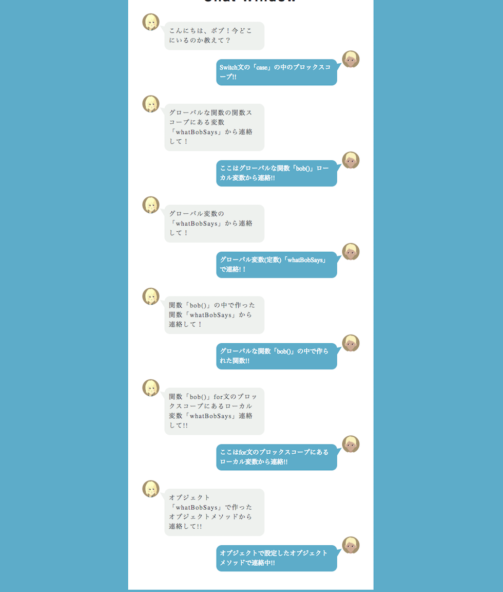

# チャレンジ8

```
所要時間: 30分
ステータス:
タイプ:
```

## 目的

- グローバルスコープとローカルスコープの適用範囲を学ぶ。

## チャレンジの取り組み方

1. マイルストーンごとに要件に合うようにファイルを編集していきます。
2. 分からない部分があれば、テキストを復習して、再度チャレンジしてみましょう。
3. 再チャレンジしてしばらく考えても分からない場合はチャットでメンターに質問しましょう。
4. 完成したら、Dropboxでメンターとファイルを共有して下さい。
5. メンターから課題レビューが届きます。
6. ビデオチャットの際は、分からない点を更に突っ込んで聞いたり、より良い書き方を聞いてみましょう。

## 概要
スコープの適用範囲を適切に取得して、アリスとボブが会話するチャット画面を完成させましょう。
アリスがボブに語りかけそれにボブが答えます。スターターファイルではアリスの言葉のみが表示されボブの吹き出しは空白となっています。

### 完成見本図


上に示した見本図のボブの吹き出しは上から順にIDの0番から5番までの計6個でラベル付されているものとします。


## スターターファイル

自分のパソコン上に、challenge8というフォルダを作って、その中に`index.html`、 `styles.css` 、 `script.js` というファイルをそれぞれ作成しましょう。それぞれのファイルには以下のスターターファイルの内容をコピーして下さい。

[codegrit-js-unit01-ch08-starter](https://github.com/codegrit-jp-students/codegrit-js-unit01-ch08-starter)

## マイルストーン１

### 要件

作業は`script.js`のみ編集していきます。`index.html`と`styles.css`はそのままにしておいて問題ありません。以下では`script.js`ファイルを使った要件に関して説明して行きます。

1. 冒頭に表示に使う文字列定数を確認して下さい。以下の文字列をグローバルスコープに定義してあります。
```js
//グローバル変数
const LOCAL_SWITCH = "Switch文の「case」の中のブロックスコープ!!"; //ID 0
const LOCAL_BOB =  "ここはグローバルな関数「bob()」ローカル変数から連絡!!"; //ID 1
const GLOBAL = "グローバル変数(定数)「whatBobSays」で連絡!！"; //ID 2
const LOCAL_NEST_FUNCTION = 'グローバルな関数「bob()」の中で作られた関数!!'; //ID 3
const LOCAL_FOR = "ここはfor文のブロックスコープにあるローカル変数から連絡!!"; //ID 4
const LOCAL_OBJ = "オブジェクトで設定したオブジェクトメソッドで連絡中!!"; //ID 5
```
表示させる順番はこの表示の順番通りです。またこれらの6つのボブの発言をID0〜ID5の番号でラベル付けするものとします。

2. コードの流れを先に確認しましょう。

#### `window.onload`

ブラウザが起動するとまずはじめに次の`window.onload`が実行されます。ここで中に記載した`bob(talkID)`という関数が実行されます。
```js
window.onload= function(){
    //起動時に呼び出す関数
    bob();
}
```

#### `関数bob()`
この関数`bob()`が実行されると、内部に記述したfor文が実行されます。
```js
for(let talkID=0; talkID<=5; talkID++){
    //処理文;
}
```
for文は0〜5回まで処理を繰り返し、その度に要件を満たせばhtml要素に文字列を格納して行きます。この処理の中で適切な物を表示させることが今回の課題です。

#### `関数setDialog(whatHeSays,talkID)`
先ほど説明した関数`bob()`は別の関数`setDialog(whatHeSays,talkID)`を呼び出します。この関数の引数にはグローバルスコープで定義した、ブラウザにボブの言葉を表示させるための文字列を格納します。`talkID`は0〜5の整数値ラベルです。この関数は以下のように一行記述することで実行できます。
```js
setDialog(whatBobSays,talkID);
```
関数が実行されると、入力したIDの番号の吹き出し画面に入力した文字列が表示されます。
この関数については完成されていて自動的に行われますので特に作業する必要はありません。

#### 表示させる文字列とスコープのルール。
ここではどのように文字列をするかについて説明します。

まず関数`bob()`に記述された`switch文`を見てください。
```js
switch(talkID){
    case 0: //itch文の`case`の中で、ID2の文字列が格納された変数`whatBobSays`を宣言して使用する
    break;

    case 1: //ID1の文字列が既に格納され関数`bob()`のローカル変数`whatBobSays`を使用する
    break;

    case 2: //ID2の文字列が既に格納されたグローバル変数`whatBobSays`を使用する
    break;

    case 3://関数`bob()`の中で関数`whatBobSays`を作成し、その中で宣言したものを利用する
    break;

    case 4: //関数`bob()`内のfor文のブロックスコープにある、ID4の文字列が格納された変数`whatBobSays`から取得する
    break;

    default: //オブジェクトを作成し、ID5の文字列を返すオブジェクトメソッド`whatBobSays`を使用する
    break;
}
```
このswitch文は`talkID`の番号により制御・分岐されています。この各分岐の中でID番号と取得したボブの言葉を格納した変数を使い、`setDialog(whatBobSays,talkID)`を呼び出せば、ブラウザ上のhtml要素に言葉が反映されます。
このコードにコメントが付与されているように、各分岐処理の中では以下のルールに従って、各分岐処理で使う文字列定数を取得するものとします。全て使用する変数名が同じ`whatBobSays`となっています。

文字列の取得方法
- ID0 : sitch文の`case`の中で、ID2の文字列が格納された変数`whatBobSays`を宣言して使用する
- ID1 : ID1の文字列が既に格納され関数`bob()`のローカル変数`whatBobSays`を使用する
- ID2 : ID2の文字列が既に格納されたグローバル変数`whatBobSays`を使用する
- ID3 : 関数`bob()`の中で関数`whatBobSays`を作成し、その中で宣言したものを利用する
- ID4 : 関数`bob()`内のfor文のブロックスコープにある、ID4の文字列が格納された変数`whatBobSays`から取得する
- ID5 : オブジェクトを作成し、ID5の文字列を返すオブジェクトメソッド`whatBobSays`を使用する

#### ID1,ID2,ID4について
ID1,ID2,ID4については既に宣言のコードがそれぞれの場所で記述されています。これらは全て同じ名前を持っているものの、それぞれが異なったスコープを持っているためエラーとはなりません。
練習のためにこれらの`変数名と格納された定数文字列は変更しないで`、switch文の内の分岐処理で取り扱えるかどうかチャレンジして見てください。ただし、`var,let,constの他の宣言名を使う`および、別の変数を新しく作って格納する方法は構いません。絶対的な正解はありませんが、なぜそのような挙動になるのかという部分の理解を深めて行けると良いと思います。

#### ID0について
sitch文の`case`の中でただ`whatBobSays`で変数宣言するだけでは、他の同じ名前の変数と重複する恐れもあり、もしかすると上手くいかないかもしれません。swich文はこれまで、switch文全体をブロック{}で囲むことはありましたが、各caseの中でブロックを作るというのはあまり馴染みがないかもしれません。しかし実際はブロックスコープはを各分岐処理内でも効きますし、これを利用することは非常に重要なテクニックになります。この考え方は他のID番号のswitchの分岐処理でも使えるので、まずID0から取りかかると良いでしょう。

#### ID3について
ID3についてはswitch分岐処理の中で`関数whatBobSays()`を作成して見てください。関数の作成に慣れない場合もあるかもしれないのですが、この関数の役割は呼び出した際に、中で文字列用の変数を宣言し、それを`戻り値`という形で返すという非常に単純なものです。次のような例が参考になるでしょう。また確認として関数のブロックで囲まれた範囲は外部からアクセスできない関数スコープというローカルスコープを持ちます。
```js
//関数定義。定義した関数を変数に代入
let func =  function(){
    const a = "100";
    return a; //aを戻り値とする
};

//関数呼び出し
console.log(func());
```

#### ID5について
ID5についてもswitch分岐処理の中で`whatBobSays()`を作成して見てください。
オブジェクトのメソッドの作成は、以下のようになります。
```js
let obj = {
  name: "Max",
  age: 20,
  func: function() {
    this.name = "Taro";//オブジェクトの中のnameプロパティを指定
    return this.name;
  }
};
console.log(obj.func()); // "Taro"
```
これは、レッスン8のテキストの`this`の章から引用したものです。
オブジェクト内で関数を作って、その中で文字列用の変数を宣言して見てください。

#### ブラウザ画面について
正しく表示された場合はブラウザのアリス(左側)とボブ(右側)の説明はセットになるようになっているので答え合わせが出来ます。


#### その他

- もし`talkID`が`window.onload`の中で宣言されていたとしても問題なく動くでしょうか？全ての要件が完了した後で確認してみましょう。また結果について考察してみましょう。


## 評価

課題の後、以下の２つについてメンターにフィードバックをお願いします。

1. 要件のカバー度: 1.全く出来なかった 2.ほとんど出来なかった 3. 半分ほどは出来た 4.8割ほどは出来た 5. 全部出来た
2. 難易度: 1. とても難しかった 2. 難しかった 3. ちょうど良かった 4. 簡単だった 5. とても簡単だった
