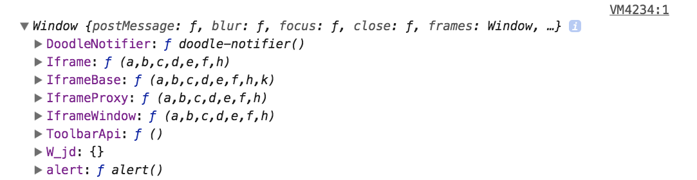

# 関数スコープ

すでに**_ブロックスコープ_**について説明しましたが、他の**_ローカルスコープ_**の概念として**_関数スコープ_**と呼ばれるものがあります。
関数ブロック内で宣言された変数は**_ローカルスコープ_**をもち、その変数は**ローカル変数**になります。関数内の**ローカル変数**が持つ有効範囲のことを**_関数スコープ_**と言います。

## 関数について

**_関数_**とは、ある処理を繰り返し使用できるように「{}」で囲んだブロック内に処理をまとめたものです。関数の詳細についてはレッスン9で学びますが、ここでは簡単な説明のみに留めます。**_関数_**は**_ブロック_**を持ちます。**_関数_**の**_ブロック_**は内部の変数の有効範囲に影響を与えます。**_関数_**の持つ有効範囲のことを**_関数スコープ_**と言います。

**_関数スコープ_**の特徴として、宣言時のキーワードが`var`、`let`、`const`のいずれであるかに関わらず、関数スコープを持つ変数に外部からアクセスすることはできません。

```js
let textGlobal = 'グローバル変数です';

function sample() {
  let textLocal = 'ローカル変数です';
  console.log(textLocal);
}

sample(); // "ローカル変数です"
console.log(textGlobal); // "グローバル変数です"
console.log(textLocal); // undefined
```

<iframe width="100%" height="300" src="//jsfiddle.net/codegrit_hiro/bg7Ln4d8/1/embedded/js,result/dark/" allowfullscreen="allowfullscreen" allowpaymentrequest frameborder="0"></iframe>

## グローバルオブジェクトのプロパティ

ブラウザでJavaScriptを処理する際は、**_グローバルオブジェクト_**として**windowオブジェクト**が定義されています。
`var`で宣言した変数は**windowオブジェクト**のプロパティになることができますが、`let`および`const`は、**windowオブジェクト**のプロパティになることができません。

```js
var valueVar = "var";
let valueLet = "let";
const valueConst = "const";

console.log(window.valueVar);// "var"
console.log(window.valueLet);// undefined
console.log(window.valueConst);// undefined
```

## this

**_スコープ_**の場所を明示するために`this`キーワードを使うことがあります。
以下で見ていくように`this`が何を意味するのかは、それが使われる文脈によって異なってきます。

### グローバルスコープで使う`this`

試しに次のコードをグローバルスコープ上で実行してみます。

```js
console.log(this);
```

結果はChromeのコンソールで次のような**Windowオブジェクト**が出力されました。



つまりグローバルスコープ上でthisを使う時、これはウェブブラウザ上の**windowオブジェクト**を指します。
従って次のような、**厳密等価演算子**を使った場合、この条件式は`true`を返します。

```js
console.log(this === window); // true
```

### 通常の関数と`this`

関数内で記述されたthisは、その関数が呼び出された時、その呼び出し元のオブジェクトを指します。

次の例を見てみましょう。

```js
function sample() {
  console.log(this);
}

sample();
```

出力結果:

```
[object Window] {
  addEventListener: function addEventListener() { [native code] },
  alert: function alert() { [native code] },
...
```

<iframe width="100%" height="300" src="//jsfiddle.net/codegrit_hiro/kwc5j961/1/embedded/js,result/dark/" allowfullscreen="allowfullscreen" allowpaymentrequest frameborder="0"></iframe>

このように関数スコープ内でthisを使った場合も通常は**windowオブジェクト**を指します。
ただし次のサンプルコードのように、オブジェクトのメソッド定義内でthisが使われる時、このthisは**windowオブジェクト**ではなく、**そのオブジェクト自身**を指します。

```js
let obj = {
  name: 'Max',
  age: 20,
  setName: function() {
    this.name = 'Taro'; // オブジェクトの中のnameプロパティを指定
    return this.name;
  }
};

console.log(obj.setName()); // "Taro"
```

<iframe width="100%" height="300" src="//jsfiddle.net/codegrit_hiro/r0zjams5/1/embedded/js,result/dark/" allowfullscreen="allowfullscreen" allowpaymentrequest frameborder="0"></iframe>

上記の例では関数呼び出しで`obj.name`と呼び出すところで`this.name`となっています。

これは関数をオブジェクト定義外で作成した場合でも変わりません。この場合でもthisは関連づけられるオブジェクトを指します。

```js
let obj = {
  name: 'Max',
  age: 20,
};

//オブジェクトメソッドを追加
obj.setName = function() {
  this.name = 'Taro';
  return this.name;
}

console.log(obj.setName()); // "Taro"
```

### イベントとThis

html上にイベントのトリガーとして`<button>`を用意して次のコードがどうなるかを確認してみます。

```html
<!--html-->
<button>ボタン</button>
```

```js
//通常の関数を使ってイベント処理を記述
let btn = document.querySelector('button');
function btnClicked() {
  console.log(this);
}

btn.addEventListener('click', btnClicked);
```

これを実行すると下記のようにボタン要素がコンソールに出力されます。つまりこの時thisは**windowオブジェクト**ではなく、関数を呼び出すトリガーとなった`<button>`要素になります。

出力結果:

```js
[object HTMLButtonElement] {
  accessKey: "",
  addEventListener: function addEventListener() { [native code] },
...
```

<iframe width="100%" height="300" src="//jsfiddle.net/codegrit_hiro/m62htgou/1/embedded/js,result/dark/" allowfullscreen="allowfullscreen" allowpaymentrequest frameborder="0"></iframe>

### アロー関数とthis

**_アロー関数_**はES6から追加された関数の定義方法のひとつです。**_アロー関数_**の定義構文では下記のように`=>`の「矢印記号」を使って関数を定義するのが特徴です。

```js
//アロー関数による関数定義の例
let arrowFunc = () => console.log(this);
```

先ほどのボタン要素による関数呼び出しの例では、その関数内のthisは呼び出し元のボタン要素を指していました。ところが**_アロー関数_**を使った場合は、**windowオブジェクト**を指します。

```js
// アロー関数を使った場合
let btn = document.querySelector('button');

//アロー関数を使ったイベント処理の定義
let btnClicked = () => console.log(this);
btn.addEventListener('click', btnClicked);
```

出力結果:

```js
[object Window] {
  addEventListener: function addEventListener() { [native code] },
  alert: function alert() { [native code] },
...
```

このように**_アロー関数_**では、thisの指し示す内容が使われる状況によって変わることはなく、定義された時の対象を保持(束縛)し続けます。これは**_アロー関数_**の大きな特徴です。
